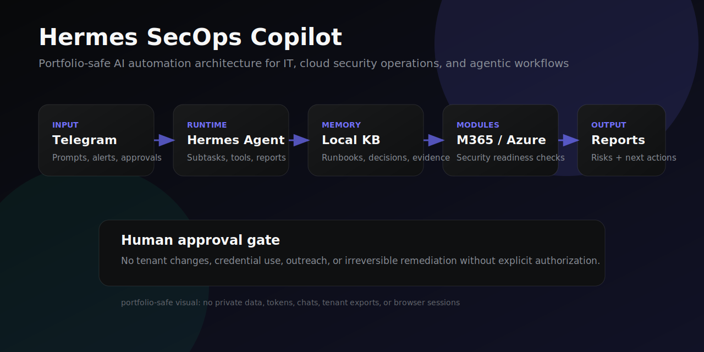

# Hermes SecOps Copilot — AI Automation Portfolio

Portfolio-safe project for **AI automation in IT, cloud security operations, and agentic workflows**.

This repository presents a public portfolio case study around a Hermes/OpenClaw-style operational assistant: a VPS-based AI agent interface for Microsoft 365/Azure security readiness, Copilot readiness, identity hardening, FinOps/GenAI cost-control prompts, local memory/runbooks, and human approval gates.

> Status: portfolio/prototype documentation. It is intentionally sanitized and does not include private credentials, tenant data, private Telegram messages, browser sessions, or customer records.

## Live portfolio

- GitHub Pages site: https://gdc88.github.io/boris-hermes-secops-portfolio/
- PDF version: [`docs/Boris-Hermes-SecOps-Portfolio.pdf`](docs/Boris-Hermes-SecOps-Portfolio.pdf)
- Detailed case study: [`docs/case-study.md`](docs/case-study.md)

## Professional positioning

**Senior IT infrastructure and cloud operations professional building AI automation for Microsoft 365/Azure security, Copilot readiness, identity hardening, hybrid cloud operations, and agent-driven workflows.**

## Architecture overview

## What the portfolio demonstrates

- Turning AI-agent tooling into practical IT/cloud operations workflows.
- Microsoft 365/Azure security readiness thinking: identity, access, consent, Copilot data exposure, and security posture.
- Agentic workflow design: Telegram interface, local memory, sub-tasks, evidence-oriented reports, and human approval gates.
- Public-safe communication: clear claims, manual-verification boundaries, and no overstatement of production scope.

## Target roles

- Cloud Security Operations Engineer
- Microsoft 365 / Azure Security Engineer
- AI Automation Engineer — IT Operations
- Infrastructure Automation Engineer
- Copilot / M365 Readiness Consultant
- Hybrid Cloud Operations Engineer
- Systems / Cloud Engineer with AI automation focus

## Safety and privacy boundary

This repository avoids publishing:

- API keys, tokens, credentials, or auth files
- real tenant exports or customer data
- private Telegram/Gmail/Sheets content
- browser profiles, cookies, or session state
- screenshots containing personal records or private URLs

Real tenant execution would require explicit authorization, scoped credentials, logging, and human approval before sensitive actions.

## Suggested Short positioning

> 14-year IT infrastructure/cloud/systems professional repositioning into AI automation for cloud security operations, Microsoft 365/Azure readiness, Copilot governance, identity hardening, and agentic IT workflows.
## Portfolio evolution

This repository is part of an evolving AI-automation portfolio, not a one-off demo. The projects show a growth path from job-search automation and local MVPs toward safer IT/cloud/security operations with agentic workflows.

Current portfolio map:

- **[Hermes SecOps Copilot](https://github.com/gdc88/boris-hermes-secops-portfolio)** — Newest portfolio layer: Hermes/OpenClaw-style AI automation for cloud security operations, M365/Azure readiness, Copilot governance, and agentic workflows. Live page: https://gdc88.github.io/boris-hermes-secops-portfolio/
- **[AI Automation Ops Lab](https://github.com/gdc88/boris-ai-automation-ops-lab)** — Operational base layer: self-hosted AI automation patterns, Telegram delivery, scheduled agents, browser-assisted workflows, and infrastructure operations thinking.
- **[Ops Agent Playbook Runner](https://github.com/gdc88/ops-agent-playbook-runner)** — Engineering proof layer: safe, auditable, dry-run-first operations playbooks with evidence bundles and policy controls.
- **[AI Resume Adapter Bot](https://github.com/gdc88/ai-resume-adapter-bot)** — Career automation layer: ATS/job-description analysis and truthful resume tailoring workflow for the German market.
- **[JobMatch AI](https://github.com/gdc88/JobMatch-AI)** — Course/final-project layer: static MVP for job-match analysis, outreach message support, and portfolio demonstration.

Growth direction:

- Keep public repositories sanitized and public-safe.
- Prefer clear architecture, safety boundaries, screenshots/visuals, and evidence over private operational data.
- Update each project as the overall system matures: better runbooks, stronger guardrails, clearer German-market positioning, and more polished demos.
- Use GitHub as the proof layer for public technical growth.
